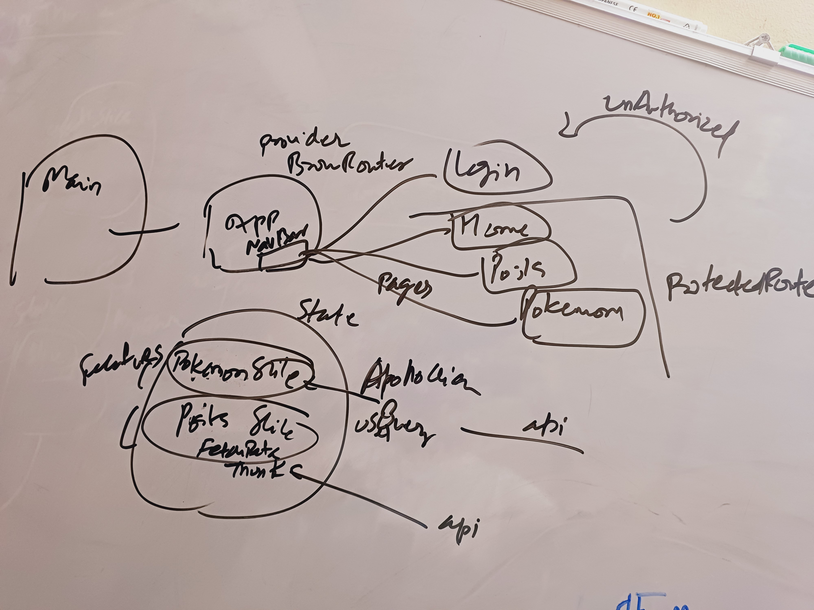

# Instructions

* At the top, write the question: "What is the architecture of the reactlearn application?"
* Below it, write bullet points explaining the role of every major piece of technology we implemented. You must answer why it was chosen.

Your list must clearly explain:

## Vite: Why did we use it as our build tool? (Think speed, developer experience).

>Vite uses ES Modules (ECMAScript 6 modules) that give better performance and simpler code splitting capabilities compared to commonjs module.exports 

>Due to this it has capability of HMR hot module replacement where it can replace a code that gets changed quickly without needing a reload and its fast

> It is also advantageous to use in production because it has a roll up feature that improves performance for production deployments. It has features like tree shaking that removes unused code and scope hoisting where all functions non conflicting are put into single common scope that improves load performance significantly. Reduces file size and improves minification as well. 

## React Router: What problem does it solve in a Single Page Application?

> It solves the problem of avoiding full page load and asynchronous loading the pages without needing navigate away. This improves navigation speed and user experience. It also allows to protect certain routes that should only be accessibly by authorized users only using ProtectedRoute. BrowserRouter is the javascript component that enables app to have Routes and Protect them. "navigate" function allows to move to a given page identified by the component name.

## Redux Toolkit: Why did we need it for global state? What specific problem (like authentication state) did it solve that useState couldn't handle elegantly?

> When use used useState instead of redux to manage global state, the component had to itself handle the logic of making asynch external calls to fetch data & update the state. However with Redux, the global state and slices for each feature that handle that part of state, dispatching changes to update state reliably and features like asyncthunk with inbuilt data fetch helped keep the external data handling also within the slice. All this improve the overall react architecture. Also Redux toolkit helps with good debug tools to visualize state. 

## Redux Thunk (within Redux Toolkit): How did we handle asynchronous REST API calls with it?

> createAsyncThunk is imported from @reduxjs/toolkit and a handler is passed that will fetch data from api and return it. The thunk has inbuilt actions during data fetching operations that will be handled by extrareducers that update the state. Once thunk is created, it is imported into component and its actions dispatched in useEffects for rendering UI as the state changes

## Apollo Client: Why did we introduce another data-fetching library? What are the benefits of GraphQL and useQuery over the Redux/Thunk approach for server state?

> The traditional way of fetching data pulls all the fields even though not required by application causing slowness, inefficient data bandwidth usage. It would be wise to fetch only those fields which are needed by the component. GraphQL helps specific the fields that are required. ApolloClient is popular GraphQL client that provides a hook called useQuery that accepts a graphql query, completely abstracts the actions dispatching and fetching data and just giving three state variables that can be bound to UI to render as they change. This reduces overall coding needed and makes overall application very efficient. 

## JWT Authentication Flow: How do your ProtectedRoute and authSlice work together to secure parts of the application?

authSlice encapulates the state and its handling for authentication data. ProtectedRoute uses the authentication state data to redirect user to login if not authenticated (using navigate components) or continue to allow user intended navigation using Outlet components imported from react-router-dom library

Do not just list the technologies. Write a sentence or two for each, explaining its purpose and the problem it solves in your project. This document is the script for your interview.

## What is the Architecture of the reactlearn application?

